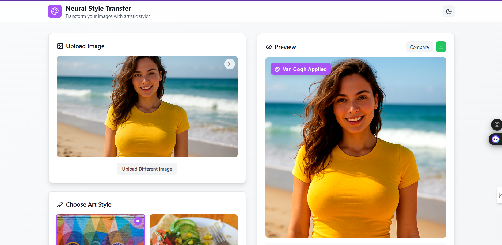

# Neural Style Transfer Previewer


A modern web application that allows users to preview neural style transfer effects on their images. Built with **React**, **TypeScript**, **Vite**, and **Tailwind CSS** for a fast and responsive user experience.




---

## ✨ Features

- **Image Upload:** Upload your own photos for style transfer.
- **Style Gallery:** Browse and select from a variety of artistic styles.
- **Live Preview:** Instantly see how your image looks with the selected style.
- **Responsive UI:** Clean, fast, and mobile-friendly interface.
- **Modern Stack:** Built with React, TypeScript, Vite, and Tailwind CSS.

---

## 🛠️ Setup Guide

### Prerequisites

- [Node.js](https://nodejs.org/) (v18 or later recommended)
- [npm](https://www.npmjs.com/) (comes with Node.js)

### Installation Steps

1. **Clone the repository:**
   ```sh
   git clone https://github.com/your-username/Neural_Style_tranfer_Previewer.git
   cd Neural_Style_tranfer_Previewer
   ```

2. **Install dependencies:**
   ```sh
   npm install
   ```
   > **Note:** If you encounter dependency issues, ensure your `vite` version is compatible with `@vitejs/plugin-react` (see the `package.json` for details).

3. **(Optional) Fix Dependency Conflicts:**
   - If you see errors about incompatible versions, edit your `package.json` to use `vite@^5.0.0` and re-run `npm install`.
   - If you have trouble, try cleaning up with:
     ```sh
     # On Windows PowerShell
     Remove-Item -Recurse -Force node_modules, package-lock.json
     npm install
     ```

---

## 🚀 Usage

### Running the App in Development

```sh
npm run dev
```
- Open your browser and go to the local URL provided (usually [http://localhost:5173](http://localhost:5173)).

### Building for Production

```sh
npm run build
```
- The optimized build will be output to the `dist` directory.

### Previewing the Production Build

```sh
npm run preview
```
- This will locally serve the production build for testing.

### Linting

```sh
npm run lint
```
- Checks your code for linting errors using ESLint.

---

## 🗂️ Project Structure

```
Neural_Style_tranfer_Previewer/
├── src/
│   ├── components/
│   │   ├── ImagePreview.tsx
│   │   ├── ImageUploader.tsx
│   │   ├── LoadingSpinner.tsx
│   │   └── StyleGallery.tsx
│   ├── types/
│   ├── App.tsx
│   ├── main.tsx
│   └── index.css
├── index.html
├── package.json
├── tailwind.config.js
├── postcss.config.js
├── tsconfig.json
└── vite.config.ts
```

---

## 🤝 Contributing

Contributions are welcome! Please open issues or submit pull requests for improvements and bug fixes.

---


---

## 🙏 Acknowledgements

- [React](https://react.dev/)
- [Vite](https://vitejs.dev/)
- [Tailwind CSS](https://tailwindcss.com/)
- [TypeScript](https://www.typescriptlang.org/) 